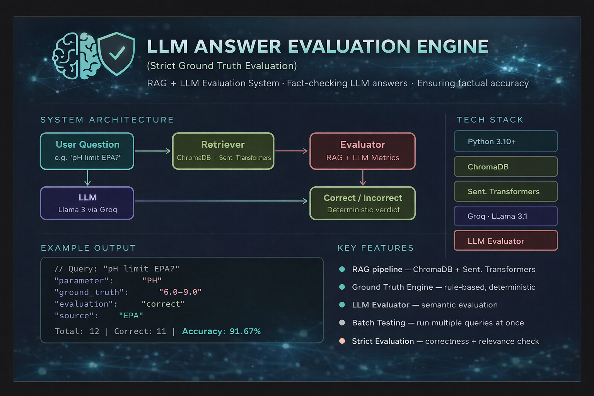

# 🔍 RAG + LLM Evaluation System

> Accuracy: ~91.7% on mixed query batch test

A deterministic evaluation framework that tests whether an LLM provides
correct answers based on environmental regulation data (EPA & SKKY).

---

## 🎯 Purpose

This is **not a chatbot**.  
It is an **LLM evaluation system** designed to answer:

> *"Is the model's answer correct — and by how much?"*

---

## 🧠 System Architecture
```
User Question
     ↓
RAG Pipeline (ChromaDB + Sentence Transformers)
     ↓
LLM (Groq API – Llama 3.1)
     ↓
Ground Truth Engine (rule-based, deterministic)
     ↓
Evaluator (compares answer vs. ground truth)
```

---

## ⚙️ Features

- 🔎 **RAG** — ChromaDB + Sentence Transformers for context retrieval
- 🤖 **LLM** — Groq API (Llama 3.1) for answer generation
- 📊 **Ground Truth Engine** — rule-based, deterministic validation
- ✅ **Smart Evaluator** — numeric + semantic comparison
- 🧪 **Batch Testing** — run multiple queries at once
- 📈 **Accuracy Calculation** — quantified evaluation output

---

## 📦 Tech Stack

| Component | Technology |
|---|---|
| Language | Python 3.10+ |
| Vector Store | ChromaDB |
| Embeddings | Sentence Transformers |
| LLM API | Groq (Llama 3.1) |
| Parsing | Regex |

---

## 🚀 Getting Started
```bash
git clone https://github.com/secilovs/rag-llm-evaluator.git
cd rag-llm-evaluator
pip install -r requirements.txt
python main.py
```

> Set your Groq API key as an environment variable:  
> `export GROQ_API_KEY=your_key_here`

---

## 📊 Example Output

**Input:**
```
pH limit EPA?
```

**Output:**
```json
{
  "parameter": "PH",
  "ground_truth": "6.0-9.0",
  "llm_answer": "The pH limit according to the EPA is 6.0 to 9.0.",
  "evaluation": "correct",
  "source": "EPA"
}
```

**Batch Test Result:**
```
Total: 12 | Correct: 11 | Accuracy: 91.67%
```

---

## ⚠️ Current Limitations

- Ambiguous queries may fail (e.g., "Turkey EPA" without source specification)
- Basic source detection logic
- Limited to EPA and SKKY datasets

---

## 🔮 Roadmap

- [ ] Improved query understanding (NER / intent detection)
- [ ] Multi-source conflict resolution
- [ ] Larger regulation dataset
- [ ] RAGAS integration for advanced evaluation metrics

---

## 💡 Key Insight

> This project focuses on **evaluation**, not generation.  
> The goal: measure whether the model is *correct* — not just fluent.

---

*Built with 🌿 environmental data and a focus on LLM reliability.*
