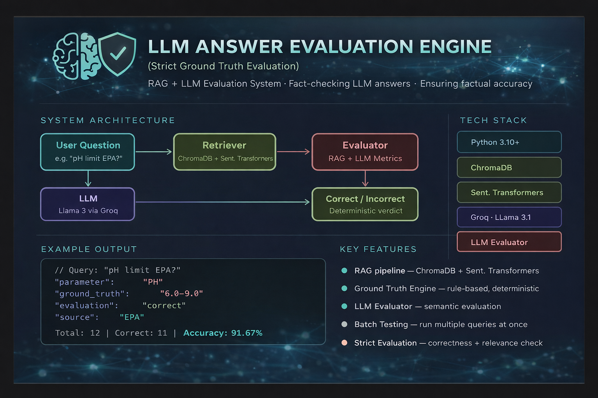

# RAG + LLM Evaluation — Proof of Concept

A small experiment in evaluating LLM answers against ground truth, instead of asking another LLM to judge them.

## The question behind it

LLMs produce answers that sound confident but can be factually wrong. In regulated domains — wastewater discharge limits, for example — a fluent wrong answer is worse than no answer.

So: **is the model actually correct, or does it just sound correct?**

Most evaluation setups answer this by asking a second LLM to grade the first. That inherits the same problem. This experiment takes a different route: compare the answer to the real regulatory value, using a rule, not a judgment.

*Evaluation pipeline: retrieval → generation → deterministic ground-truth check*

## What it does

Given a question like *"What is the EPA pH limit?"*, the system:

1. **Identifies the parameter and source** from the question (BOD, COD, TSS, pH — EPA or SKKY) using keyword matching.
2. **Looks up the ground truth** from a hardcoded table of EPA and SKKY (Su Kirliliği Kontrolü Yönetmeliği) discharge limits.
3. **Retrieves context** — the question is embedded with `all-MiniLM-L6-v2`, matched against a small ChromaDB collection, and the two closest passages are returned.
4. **Asks the LLM** (Groq, Llama 3.1 8B, `temperature=0`) to answer using only that retrieved context.
5. **Evaluates deterministically** — numeric values are extracted from the answer with regex and compared against the ground truth. Match → `correct`. Mismatch → `incorrect`. No LLM is involved in this decision.

Output:

{
  "parameter": "PH",
  "ground_truth": "6.0-9.0",
  "llm_answer": "The pH limit according to the EPA is 6.0 to 9.0.",
  "evaluation": "correct",
  "source": "EPA"
}

## Stack

| Component    | Technology            |
| ------------ | --------------------- |
| Language     | Python 3.10+          |
| Vector store | ChromaDB              |
| Embeddings   | Sentence Transformers (all-MiniLM-L6-v2) |
| LLM          | Groq (Llama 3.1 8B)   |
| Evaluation   | Regex + rule-based comparison |

## Scope and limitations

This is a proof of concept, not a production system. Specifically:

- The document collection is **five hardcoded sentences**, not a parsed corpus.
- Ground truth is a **hardcoded dictionary** covering four parameters across two sources.
- Source detection is crude: the query defaults to EPA unless it mentions Turkey or SKKY.
- The evaluator compares numbers only. Format and unit checking is not enforced.
- Ambiguous or out-of-scope queries will fail rather than degrade gracefully.

## What it demonstrates

The point is the evaluation design, not the scale:

- Ground truth beats LLM-as-judge when the correct answer is knowable.
- `temperature=0` matters — an evaluator needs the model under test to be reproducible.
- Fluency is not correctness, and a rule-based check will say so where a second LLM might not.

## Possible next steps

- Parse the actual `epa.txt` and `skky.txt` files instead of the hardcoded document list
- Intent detection for source and parameter, replacing keyword matching
- Unit and format validation alongside numeric comparison
- Wider regulatory coverage

---

Seçil Bayar — Environmental Engineer (PhD) → LLM Evaluation
